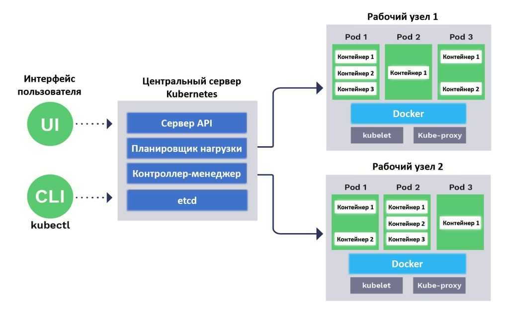
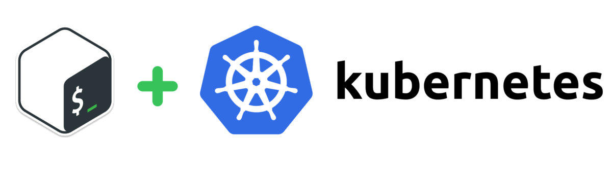

# Описание всех сущностей Kubernetes с примерами:

#                                                                | Kubernetes |

`Kubernetes` - это платформа управления контейнерами, которая позволяет автоматизировать развертывание, масштабирование и управление приложениями в контейнерах.
Для управления контейнеризированными приложениями Kubernetes использует ряд различных сущностей, каждая из которых выполняет определенную роль в организации приложений и ресурсов.



#                                                                | Node |

`Node` - это логическая коллекция IT-ресурсов, которая выполняет рабочие нагрузки для одного или нескольких контейнеров в кластере Kubernetes.
Ноды содержат сервисы, которые обеспечивают работу контейнеров.

Каждый под в Kubernetes всегда работает на ноде.
Нода является рабочей машиной в Kubernetes и может быть виртуальной или физической машиной, в зависимости от кластера. Каждая нода управляется плоскостью управления Kubernetes.
На одной ноде может быть развернуто несколько подов, и плоскость управления Kubernetes автоматически обрабатывает планирование подов по нодам в кластере.
Автоматическое планирование учитывает доступные ресурсы на каждой ноде.

Каждая нода Kubernetes всегда имеет следующие ключевые компоненты:

`Kubelet` - это процесс, отвечающий за коммуникацию между плоскостью управления Kubernetes и нодой.

`Kubelet` управляет подами и контейнерами, работающими на машине.
Каждая нода представляет собой минимальную вычислительную единицу в Kubernetes и предоставляет вычислительные ресурсы для развертывания и выполнения контейнеров.
Ноды могут быть добавлены или удалены из кластера для масштабирования и управления нагрузкой и доступностью приложений.

#                                                                | Pod |

`Pod` - это наименьшая и наименее управляемая единица в Kubernetes.
Он представляет собой группу одного или нескольких контейнеров, которые разделяют пространство и ресурсы (например, сеть и хранилище) и работают вместе для выполнения конкретной задачи или сервиса.

> Пример файла Pod YAML:
```yml
apiVersion: v1
kind: Pod
metadata:
  name: my-pod
spec:
  containers:
    - name: my-container
      image: nginx
```

#                                                                | Namespace |

`Namespace` - это пространство имён, которое позволяет разделять и изолировать ресурсы Kubernetes внутри кластера.
Он предоставляет логическое разделение между приложениями, командами или средами и помогает управлять и контролировать доступ к ресурсам.

> Пример файла Namespace YAML:
```yml
apiVersion: v1
kind: Namespace
metadata:
  name: my-namespace
```

#                                                                | Deployment |

`Deployment` - это развертывание, которое предоставляет декларативный способ управления созданием и обновлением реплик набора Pod-ов.
`Deployment` обеспечивает масштабируемость, отказоустойчивость и управление обновлениями приложений.

> Пример файла Deployment YAML:
```yml
apiVersion: apps/v1
kind: Deployment
metadata:
  name: my-deployment
spec:
  replicas: 3
  selector:
    matchLabels:
      app: my-app
  template:
    metadata:
      labels:
        app: my-app
    spec:
      containers:
        - name: my-container
          image: nginx
```

#                                                                | Service |

`Service` - это служба, которая представляет собой стабильную конечную точку, которая обеспечивает сетевой доступ к набору подов.
Это позволяет приложениям внутри кластера общаться с другими приложениями или сервисами с использованием стабильного DNS-имени.

> Пример файла Service YAML:
```yml
apiVersion: v1
kind: Service
metadata:
  name: my-service
spec:
  selector:
    app: my-app
  ports:
    - protocol: TCP
      port: 80
      targetPort: 8080
```

#                                                                | ReplicaSet |

`ReplicaSet` - это сущность, которая обеспечивает масштабирование и управление количеством экземпляров подов (подобных контейнерам) в кластере Kubernetes.
Он гарантирует, что указанное количество реплик подов всегда будет запущено и работать.

`Репликасет` используется для обеспечения отказоустойчивости и масштабируемости приложений в Kubernetes.
Если один или несколько подов в репликасете не работают, репликасет автоматически запускает новые поды, чтобы поддерживать необходимое количество реплик.
И наоборот, если число реплик уменьшается, репликасет избавляется от лишних подов.

> Пример манифеста ReplicaSet в Kubernetes:
```yml
apiVersion: apps/v1
kind: ReplicaSet
metadata:
  name: my-replicaset
spec:
  replicas: 3
  selector:
    matchLabels:
      app: my-app
  template:
    metadata:
      labels:
        app: my-app
    spec:
      containers:
        - name: my-container
          image: my-image:latest
```

#                                                                | StatefulSet |

`StatefulSet` - это постоянное множество, которое предназначено для управления приложениями, которым необходимо иметь уникальные и постоянные идентификаторы, такие как базы данных.
Он обеспечивает гарантированное развертывание и запуск подов в определенном порядке и маркирует их для устойчивого хранения данных.

> Пример файла StatefulSet YAML:
```yml
apiVersion: apps/v1
kind: StatefulSet
metadata:
  name: my-statefulset
spec:
  replicas: 3
  selector:
    matchLabels:
      app: my-app
  template:
    metadata:
      labels:
        app: my-app
    spec:
      containers:
        - name: my-container
          image: nginx
```

#                                                                | DaemonSet |

`DaemonSet` - это сущность, которая гарантирует, что по одному экземпляру пода будет запущено на каждом узле (node) в кластере.
Это полезно для развертывания агентов обслуживания, таких как сетевые решения или системные демоны.

> Пример файла DaemonSet YAML:
```yml
apiVersion: apps/v1
kind: DaemonSet
metadata:
  name: my-daemonset
spec:
  selector:
    matchLabels:
      app: my-app
  template:
    metadata:
      labels:
        app: my-app
    spec:
      containers:
        - name: my-container
          image: nginx
```

#                                                                | Ingress |

`Ingress` - это вход, позволяет управлять внешним доступом к сервисам внутри кластера Kubernetes.
С помощью `Ingress` можно определить правила маршрутизации трафика, управлять SSL-сертификатами и выполнять балансировку нагрузки на уровне HTTP.

> Пример файла Ingress YAML:
```yml
apiVersion: networking.k8s.io/v1
kind: Ingress
metadata:
  name: my-ingress
spec:
  rules:
    - host: my-domain.com
      http:
        paths:
          - path: /
            pathType: Prefix
            backend:
              service:
                name: my-service
                port:
                  number: 80
```

#                                                                | ConfigMap |

`ConfigMap` - это конфигурационная карта, которая позволяет хранить конфигурационные данные в виде ключ-значение и передавать их в поды в кластере Kubernetes.
Это полезно для хранения настроек, переменных среды или конфигурационных файлов.

> Пример файла ConfigMap YAML:
```yml
apiVersion: v1
kind: ConfigMap
metadata:
  name: my-configmap
data:
  app.properties: |
    key1=value1
    key2=value2
```

#                                                                | Secret |

`Secret` - это секрет, предназначен для хранения конфиденциальной информации, такой как пароли, ключи или сертификаты.
Secretы могут использоваться в подах для безопасной передачи и использования конфиденциальных данных.

> Пример файла Secret YAML:
```yml
apiVersion: v1
kind: Secret
metadata:
  name: my-secret
data:
  username: dXNlcm5hbWUx
  password: cGFzc3dvcmQx
type: Opaque
```

#                                                                | Volume |

`Volume` - это хранилище, которое используется для постоянного хранения данных внутри пода.
В Kubernetes есть различные типы хранилищ, включая локальные диски, сетевые диски и облачные хранилища.

> Пример использования пустого "Volume" (emptyDir):
```yml
apiVersion: v1
kind: Pod
metadata:
  name: my-pod
spec:
  containers:
  - name: my-container
    image: nginx
    volumeMounts:
    - name: data-volume
      mountPath: /data
  volumes:
  - name: data-volume
    emptyDir: {}
```

#                                                                | PersistentVolume |

`PersistentVolume` - это постоянный том, который предоставляет абстракцию для физического хранилища данных в кластере Kubernetes.
Он служит для сохранения данных между перезапусками подов и предоставляет устойчивое хранение для `StatefulSet` и других приложений.

> Пример файла PersistentVolume YAML:
```yml
apiVersion: v1
kind: PersistentVolume
metadata:
  name: my-pv
spec:
  capacity:
    storage: 5Gi
  accessModes:
    - ReadWriteOnce
  hostPath:
    path: /data
```

#                                                                | PersistentVolumeClaim |

`PersistentVolumeClaim` - это запрос постоянного тома, используется для запроса доступа к определенным ресурсам постоянного тома в Kubernetes.
`PVC` предоставляет абстракцию над `PersistentVolume` и позволяет пользователям запросить определенное хранилище данных для своих приложений.

> Пример файла PersistentVolumeClaim YAML:
```yml
apiVersion: v1
kind: PersistentVolumeClaim
metadata:
  name: my-pvc
spec:
  accessModes:
    - ReadWriteOnce
  resources:
    requests:
      storage: 1Gi
```

#                                                                | Job |

`Job` - это задание, которое представляет собой однократное или ограниченное выполнение задачи в кластере.
`Job` гарантирует, что все поды внутри него успешно завершат свою работу.

> Пример файла Job YAML:
```yml
apiVersion: batch/v1
kind: Job
metadata:
  name: my-job
spec:
  completions: 1
  template:
    metadata:
      name: my-pod
    spec:
      containers:
        - name: my-container
          image: nginx
      restartPolicy: Never
```

#                                                                | CronJob |

`CronJob` - это крон-задание, которое позволяет запускать задачи внутри кластера Kubernetes по заданному расписанию, аналогично cron в операционных системах.
Это полезно для выполнения регулярных или периодических задач, таких как резервное копирование данных или очистка временных файлов.

> Пример файла CronJob YAML:
```yml
apiVersion: batch/v1
kind: CronJob
metadata:
  name: my-cronjob
spec:
  schedule: "* * * * *"
  jobTemplate:
    spec:
      template:
        spec:
          containers:
            - name: my-container
              image: nginx
          restartPolicy: OnFailure
```

#                                                                | Helm Chart |

`Helm Chart` - это пакетированный формат для развертывания и управления приложениями в Kubernetes.
Он представляет собой набор файлов, описывающих структуру и конфигурацию приложения, а также зависимости и параметры, необходимые для его развертывания.

> Пример файла HelmChart YAML:
```yml
apiVersion: v2
name: myapp
version: 1.0.0
description: My App

dependencies:
  - name: mongodb
    version: 7.14.2
    repository: https://charts.bitnami.com/bitnami

  - name: redis
    version: 10.6.3
    repository: https://charts.bitnami.com/bitnami

services:
  - name: frontend
    replicas: 3
    image: myapp/frontend:1.0.0
    ports:
      - name: http
        containerPort: 80
    env:
      - name: ENVIRONMENT
        value: production

  - name: backend
    replicas: 2
    image: myapp/backend:1.0.0
    ports:
      - name: http
        containerPort: 8080
    env:
      - name: ENVIRONMENT
        value: production
```

В этом примере `Helm Chart` описывает две службы: frontend и backend. Каждая служба имеет свои параметры, такие как количество реплик, образ контейнера, порты и переменные окружения.
Также в `Helm Chart` указаны зависимости на другие чарты, такие как MongoDB и Redis.

Helm Chart может быть развернут в Kubernetes с помощью команды `helm install`, указав путь к файлу Chart:
```bash
helm install myapp ./myapp-chart
```
Это создаст релиз с именем `myapp`, используя `Helm Chart`, расположенный в директории `myapp-chart`.

---


# Kubernetes инструкция по оркестрированию:



### :arrow_forward: Конфиги и остальное :arrow_backward:
```bash
$ sudo su dockeradm        # Пользак у которого есть конфигурация кубера (~/.kube/config)
$ kubectl config view      # Посмотреть объединённые настройки kubeconfig
```

### :triangular_flag_on_post: Глоссарий :triangular_flag_on_post:
| Команда | Описание |
| :---: | :----: |
| "-n" означает "--namespace" | *неймспейс* |
| "-f" означает "--force"     | *в реальном времени* |
| "-f" означает "--file"      | *может означать файл* |
| -n ui [Space] ui-front      | *после пробела идет наименование пода* |
| "--all-namespaces"          | *можно сократить до "-A"* |


### :arrow_forward: Полезное :arrow_backward:
```bash
$ source <(kubectl completion bash)  # включаем автодополнение для текущего сеанса
$ kubectl version    # Посмотреть версию Kubernetes
$ ansible --version  # Посмотреть версию Ansible
$ kubectl apply -f <filename>  # Для создания и обновления ресурсов # apply управляет приложениями с помощью файлов, которые определяют ресурсы Kubernetes
$ KUBE_EDITOR="nano" kubectl edit svc/docker-registry    # Редактировать ресурс к примеру "сервис docker-registry"
```

### :arrow_forward: Работа с Kubelet :arrow_backward:
```bash
$ sudo systemctl status kubelet noda1.moscow.ne  # Посмотреть статус kubelet на ноде
$ sudo systemctl restart kubelet    # Рестарт Ноды в которой находимся
$ journalctl -u kubelet | tail -30  # Журнал службы kubelet
$ systemctl start kubelet           # Запуск службы kubelet
$ systemctl stop kubelet            # Остановка службы kubelet
```

### :arrow_forward: Работа в Service :arrow_backward:
```bash
$ kubectl get services               # Вывести все сервисы в пространстве имён
$ kubectl delete service zabbix-web  # Удалить сервис
```

### :arrow_forward: Работа в Deployment :arrow_backward:
```bash
$ kubectl get deployment --all-namespaces                # Вывести все деплойменты
$ kubectl scale deployment deployment_name --replicas=3  # Изменение количества реплик (подов) в развертывании (скеилить)
$ kubectl rollout restart deployment <deployment_name>   # Перезапуск развертывания (deployment)
```

### :arrow_forward: Работа с Pods :arrow_backward:
```bash
$ kubectl get pod -n {namespace}              # Вывести все поды в конкретном неймспейсе
$ kubectl get pods --all-namespaces           # Вывести все поды всех неймспейсов
$ kubectl get pods --all-namespaces -o wide   # Вывести все поды всех неймспейсов очень подробно с ip-шниками
$ kubectl get pods --all-namespaces -o yaml   # Вывести все поды всех неймспейсов в формате YAML
$ kubectl describe pod -n {namespace} {pod}   # NAMESPACE, NAME POD  # Посмотреть подробную инфу о поде
$ kubectl logs -n {namespace} {pod}           # NAMESPACE, NAME POD  # Посмотреть логи пода
$ kubectl get pod -n {namespace} {pod} -o yaml                              # Получить информацию по поду в формате YAML
$ kubectl get pods --field-selector=status.phase=Running --all-namespaces   # Посмотреть все запущенные поды во всех неймспейсах
$ kubectl get pods -o wide --all-namespaces | grep {namespace}              # Вывести поды с привязкой к ноде
$ kubectl port-forward -n {namespace} {pod} 8087:8080                       # Проброс портов пода себе на машину чтобы напрямую запросы в контейнер отсылать
$ kubectl logs -f -n {namespace} {pod}                                      # Вывести логи пода
$ kubectl logs -n {namespace} {pod} --since=3h > logs_3h.txt                # Выгрузить логи за последние 3 часа
$ kubectl logs -f --previous -n {namespace} {pod} > logs.txt                # Выгрузить полные логи с поды с историей в отдельный файл
$ kubectl get pods --all-namespaces -o json | jq '.items[] | .spec.nodeName' -r | sort | uniq -c                          # Посмотреть количество подов на каждой ноде
$ kubectl get pod -n {namespace} {pod} --template='{{(index (index .spec.containers 0).ports 0).containerPort}}{{"\n"}}'  # Узнать порт Поды
$ kubectl get events -n {namespace}    # Посмотреть лог почему падает и рестартится пода

$ kubectl get pods --all-namespaces -o json | jq '.items | map({podName: .metadata.name, nodeName: .spec.nodeName}) | group_by(.nodeName) | map({nodeName: .[0].nodeName, pods: map(.podName)})'  # Вывести список всех подов для каждого узла в формате JSON
$ kubectl get po --all-namespaces -o wide | grep 127.123.4.216   # Найти поду по айпишнику
$ kubectl delete pod -n {namespace} {pod}                        # Удалить под, "произвести его рестарт" (удаление пода убивает нынешней под и сразу поднимает новый)
```

### :arrow_forward: Работа с Nodes :arrow_backward:
```bash
$ kubectl get nodes                # Вывести все ноды со статусами
$ sudo systemctl restart kubelet   # Рестартануть ноду, в которой находимся
$ kubectl describe nodes {noda1}   # Посмотреть подробную инфу о ноде
$ kubectl get nodes --all-namespaces -o wide  # Вывести все ноды всех неймспейсов очень подробно с ip-шниками
```

### :arrow_forward: Работа с Namespaces :arrow_backward:
```bash
$ kubectl get namespace  # Вывести все неймспейсы
```

### :arrow_forward: Работа с Контейнерами :arrow_backward:
```bash
$ docker ps                # Показать запущенные контейнеры
$ docker ps -a             # Показать все контейнеры
$ docker logs {container}  # Показать логи контейнера
$ docker exec -it {container} psql -U postgres    # Подключаемся к БД контейнер под пользователем Postgres
$ kubectl logs -f -n {namespace} {pod}            # Вывести логи контейнера пода в режиме реального времени (в stdout, при работе с несколькими контейнерами)
$ docker stats --format "table {{.Container}}\t{{.Name}}\t{{.CPUPerc}}\t{{.MemUsage}}"  # Посмотреть какой контейнер что и как жрёт по CPU и RAM
$ kubectl exec -n {namespace} -it {pod} -- ls /tmp                                      # Из кубера выполнить команду внутри контейнера пода
$ watch -n 3 'docker stats --format "table {{.Container}}\t{{.Name}}\t{{.CPUPerc}}\t{{.MemUsage}}" | grep {container} >> stats.txt'  # Мониторинг нагрузки контейнера
```

### :arrow_forward: Работа с Configmaps :arrow_backward:
```bash
$ kubectl get configmaps -A  # Посмотреть все конфигмапы
$ kubectl get configmap -n {namespace} {pod} -o yaml  # Показать конфигмап конкретного пода в неймспейсе
```

### :arrow_forward: Работа с лейблами :arrow_backward:
```bash
$ kubectl logs -f -l name=myLabel --all-containers  # Вывести логи всех подов с меткой myLabel (в stdout)
$ kubectl logs -l name=myLabel -c {container}       # Вывести логи пода с меткой myLabel (в stdout)
```

### :arrow_forward: РЕДКОЕ: :arrow_backward:
```bash
$ kubectl drain {node}     # Эвакуация подов с узла перед его удалением из кластера
$ kubectl uncordon {node}  # Снятие запрета на планирование подов на узле
$ kubectl cordon {node}    # Запрет планирования новых подов на узле
```
